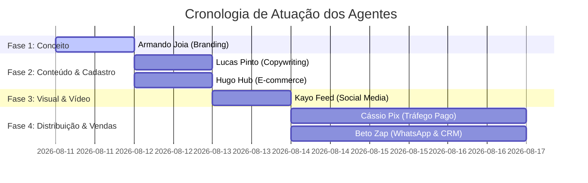

# 🔄 Workflow de Trabalho & Matriz de Agentes — Campanha Dia das Mães

Este documento detalha o fluxo de trabalho (**workflow**), a cronologia de execução e o plano de responsabilidades de cada agente especialista da equipe de Marketing para a **Campanha do Colar de Dia das Mães**.

---

## ⏱️ Linha do Tempo e Ordem de Execução

---

## 👥 Quem Trabalha Primeiro & Plano por Agente

### 1º lugar: 👑 [Armando Joia — Diretor de Marca & Posicionamento](file:///c:/Users/aleha/OneDrive/Área%20de%20Trabalho/Loja%20de%20Joias/Marketing/Agentes/agente-01-armando-joia-diretor-marca.md)
* **Status**: **PRIMEIRO A ATUAR** (Direção Estratégica)
* **Papel**: Definir o conceito emocional, o nome da coleção (*"Amor Eterno"*), o posicionamento de luxo acessível e aprovar o kit especial de presente (caixa de veludo + cartão personalizado).
* **Seu Plano**: **Plano de Branding & Conceito da Campanha**.

---

### 2º lugar: ✍️ [Lucas Pinto — Head de Copywriting & Storytelling](file:///c:/Users/aleha/OneDrive/Área%20de%20Trabalho/Loja%20de%20Joias/Marketing/Agentes/agente-02-lucas-pinto-copywriter.md)
* **Status**: **SEGUNDO A ATUAR** (Criação de Textos)
* **Papel**: Criar a narrativa emocional, escrever os roteiros de áudio/locução do vídeo do Nano Banana, a legenda completa do Instagram e os textos dos anúncios de Tráfego Pago.
* **Seu Plano**: **Plano de Copywriting & Roteiros Emocionais**.

---

### 3º lugar: 🛒 [Hugo Hub — Gestor de E-commerce & Marketplaces](file:///c:/Users/aleha/OneDrive/Área%20de%20Trabalho/Loja%20de%20Joias/Marketing/Agentes/agente-08-hugo-hub-gestor-ecommerce-marketplaces.md)
* **Status**: **TERCEIRO A ATUAR** (Paralelo à produção de copy/mídia)
* **Papel**: Garantir que a página do Colar esteja no ar na loja (Nuvemshop/Shopify) e nos marketplaces (Mercado Livre/Shopee), com NCM, estoque sincronizado, badge *"Especial Dia das Mães"* e selo *"Chega antes do Dia das Mães"*.
* **Seu Plano**: **Plano de E-commerce, Bling & Marketplaces**.

---

### 4º lugar: 🎨 [Kayo Feed — Head de Social Media & Conteúdo Visual](file:///c:/Users/aleha/OneDrive/Área%20de%20Trabalho/Loja%20de%20Joias/Marketing/Agentes/agente-03-kayo-feed-social-media.md)
* **Status**: **QUARTO A ATUAR** (Produção Visual)
* **Papel**: Pegar a imagem conceito criada, subir no **Nano Banana** para renderizar o vídeo animado com os textos do Lucas, montar a arte do carrossel do Instagram e os Stories interativos.
* **Seu Plano**: **Plano Visual, Vídeos AI & Linha Editorial Instagram**.

---

### 5º lugar: 💰 [Cássio Pix — Gestor de Tráfego Pago & Performance](file:///c:/Users/aleha/OneDrive/Área%20de%20Trabalho/Loja%20de%20Joias/Marketing/Agentes/agente-04-cassio-pix-gestor-trafego.md)
* **Status**: **QUINTO A ATUAR** (Campanhas Pagas)
* **Papel**: Pegar os vídeos do Kayo e as copies do Lucas para subir as campanhas de Meta Ads e Google Ads nos públicos de Filhos/Filhas e Maridos, gerenciando orçamento e buscando o ROAS máximo.
* **Seu Plano**: **Plano de Tráfego Pago & Otimização de ROAS**.

---

### 6º lugar: 📲 [Beto Zap — Especialista em CRM & WhatsApp Marketing](file:///c:/Users/aleha/OneDrive/Área%20de%20Trabalho/Loja%20de%20Joias/Marketing/Agentes/agente-05-beto-zap-especialista-crm.md)
* **Status**: **SEXTO A ATUAR** (Retenção & Venda Direta)
* **Papel**: Disparar a sequência VIP de Dia das Mães no WhatsApp para a base de clientes cadastrados e enviar e-mail marketing especial com a oferta de Pré-Venda com cupom.
* **Seu Plano**: **Plano de Disparos VIP & Automação WhatsApp**.

---

## 📌 Resumo da Divisão de Planos

| Agente | Ordem | Foco Principal | Entregável / Plano |
| :--- | :---: | :--- | :--- |
| **Armando Joia** | 1º | Conceito, Branding & Oferta | Linha Editorial e Conceito |
| **Lucas Pinto** | 2º | Copywriting & Roteiros | Legendas, Copies & Roteiro Vídeo |
| **Hugo Hub** | 3º | E-commerce & Estoque | Cadastro de Produtos & Bling/ERP |
| **Kayo Feed** | 4º | Design & Vídeo Nano Banana | Vídeo 15s, Carrossel & Stories |
| **Cássio Pix** | 5º | Tráfego Pago & Anúncios | Campanhas no Meta Ads & Google Ads |
| **Beto Zap** | 6º | WhatsApp & E-mail CRM | Disparos na Base & Remarketing Direto |
